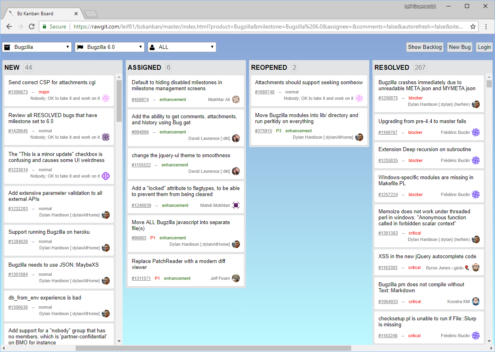

= Bz Kanban Board

== About

This allows you to visualize bugs from any Bugzilla instance on a Kanban inspired board.

The goal of bzkanban is to compliment the Bugzilla workflow you are already using, so the board columns represent the Bugzilla bug statuses (i.e. NEW, ASSIGNED, REOPENED, RESOLVED, CLOSED -- or whatever your site has renamed them to) and of course each cards represents one bug. Cards can be opened by clicking on them to view comments or add a new comment. And cards can be dragged from one column to another to change the bug status.

Bzkanban is implemented as a client side single-page application using Ajax with the http://bugzilla.readthedocs.io/en/latest/api/index.html[Bugzilla 5 server REST API]. So what? It means installation is extremely simple. For more details read the Installation section below.

== Screenshot

== Demo

http://leif81.github.io/bzkanban/index.html?product=Bugzilla&milestone=Bugzilla+6.0&assignee=&comments=false&site=https%3A%2F%2Fbugzilla.mozilla.org[Try it].

== Requirements

 . Client: A modern web browser capable of HTML5, CSS3, and JavaScript (tested with Chrome and Edge)
 . Server: A Bugzilla 5.0+ server with REST API enabled.

== Installation

Chose one of the following options to use Bzkanban.

=== No install!

This is the easiest way to use and try out bzkbanban.

1. Start by browsing to the demo URL above.
1. Change the `site=` parameter in the URL to you the URL of your Bugzilla instance. 
1. Book mark it and you're done!

Note: This method uses the latest and greatest version of the bzkanban application hosted on the GitHub `master` branch. You will get the latest fixes and enhancements automatically.

=== Local app install

If you'd prefer to run a copy of the bzkanban app from your local PC do the following:

 . Clone this git repo (e.g. `~/Downloads/bzkbanban`)
 . Open `~/Downloads/bzkbanban/index.html` and change which Bugzilla instance to connect to by modifying the `siteUrl` option.
 . Dougle click the `index.html` to run Bzkanban in your web browser. Bookmark it!
 
=== Server side app install

1. Do the same thing as the above "Local app install", but host the `bzkbanban` folder on a web server.
1. In your web browser navigate to the path of the `index.html` file (i.e. `http://www.mycompany.com/bzkbanban/index.html`). Bookmark it!

== Usage

 . In the drop down menu in the top left of the app, pick a product and milestone. The board will load.
 . To modify cards using the app, log in with your Bugzilla account (top right). You will then be able to drag cards between columns to change their state and add comments by clicking on a card.

=== Advanced Configuration

These are some settings that can be manually controlled via the page URL parameters. To apply these permanently modify them in the top section of the `bzkanban.js` file.

 * `site`
 ** The Bugzilla instance to load data from. Overrides the `siteUrl` setting. e.g. `site=https://bugzilla.mozilla.org`
 * `comments`
 ** Show comment counts on cards. WARNING: it's expensive, one more request per card. e.g. `comments=true/false`
 * `autorefresh`
 ** Reload the board when external changes to bugs are detected. e.g. `autorefresh=true/false`

== Donate

It would be great to hear (by email or by donation) if *bzkanban* has been helpful. Positive feedback is very motivating, and much
appreciated!

image::https://www.paypalobjects.com/en_US/i/btn/btn_donateCC_LG.gif[link=https://www.paypal.com/cgi-bin/webscr?cmd=_s-xclick&hosted_button_id=GKF8LEAX4BB5G]
